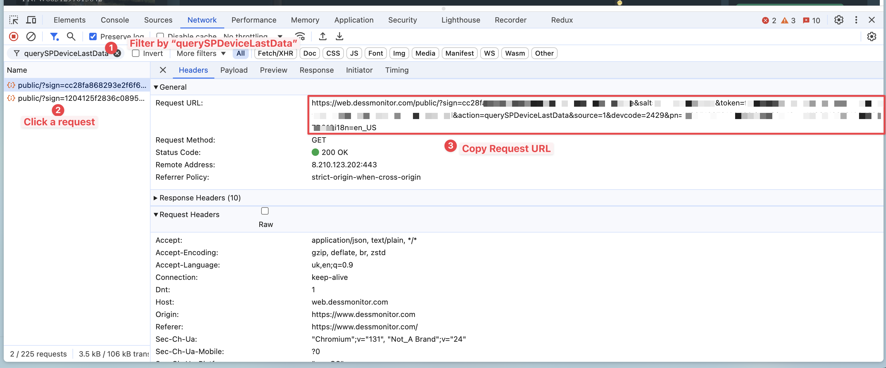
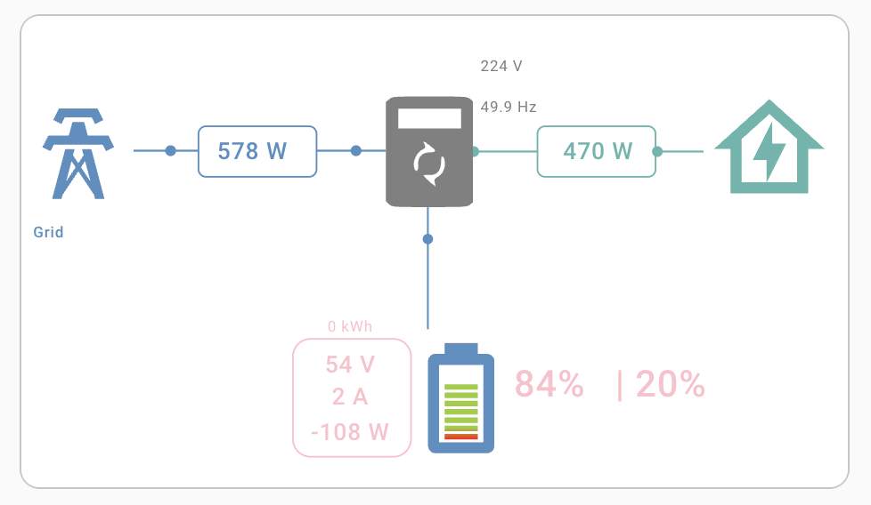

# dessmonitor.com API integration into HomeAssistant

This repo provides instruction to activate [dessmonitor.com](https://dessmonitor.com) API fetching in HomeAssistant,
create sensors for monitoring the inverter data and add a dashboard to display the data.

## Exported sensors

The following sensors are created by the API:

| Name                      | Sensor ID                        | Unit of Measure | Description                                                             |
|---------------------------|----------------------------------|-----------------|-------------------------------------------------------------------------|
| Grid Voltage              | sensor.grid_voltage              | V               | Voltage of the grid                                                     |
| Grid Frequency            | sensor.grid_frequency            | Hz              | Frequency of the grid                                                   |
| Grid Power                | sensor.grid_power                | W               | Power from the grid                                                     |
| PV1 Voltage               | sensor.pv1_voltage               | V               | Voltage of the first photovoltaic panel                                 |
| PV1 Current               | sensor.pv1_current               | A               | Current of the first photovoltaic panel                                 |
| PV1 Power                 | sensor.pv1_power                 | W               | Power of the first photovoltaic panel                                   |
| Battery Voltage           | sensor.battery_voltage           | V               | Voltage of the battery                                                  |
| Battery Power             | sensor.battery_power             | W               | Power of the battery                                                    |
| Battery SOC               | sensor.battery_soc               | %               | State of charge of the battery                                          |
| Battery Discharge Current | sensor.battery_discharge_current | A               | Discharge current of the battery                                        |
| Battery Charging Current  | sensor.battery_charging_current  | A               | Charging current of the battery                                         |
| Battery Current           | sensor.battery_current           | A               | Total current of the battery (absolute value of charging + discharging) |
| Battery Current Direction | sensor.battery_current_direction |                 | Direction of the battery current (1 for charging, 0 for discharging)    |
| Load Output Voltage       | sensor.load_output_voltage       | V               | Voltage of the load output                                              |
| Load Power                | sensor.load_power                | W               | Power of the load                                                       |

## Supported devices

This API is available for devices, that use
SmartEss ([Android](https://play.google.com/store/apps/details?id=com.eybond.smartclient.ess&hl=uk)
and [iOS](https://apps.apple.com/ua/app/smartess/id1334656760?l=uk)) mobile application.
The application is a recommended app for
the [WiFi Plug Pro](https://www.inverter.com/images/uploaded/solar-inverter-charger-wifi-plug-pro.pdf) data logger
adapter for inverters, but this adapter
is built in a bunch of inverters, so the API is available for them as well.

The following devices are checked to be supported by the API:

- Sorotec REVO VM II PRO 3.2kW/24V Wi-Fi
- Sorotec REVO VM II PRO 3.5kW/24V Wi-Fi
- Sorotec REVO HM 6kW/48V Wi-Fi
- Sorotec REVO VM IV PRO-T 6kW/48V Wi-Fi
- Sorotec REVO HMT 6kW/48V Wi-Fi
- Sorotec REVO HES 6kW/48V Wi-Fi
- Sorotec REVO HMT 11kW/48V Wi-Fi
- MuscleGrid 4.2 KW
- MuscleGrid 10.2 KW
- MuscleGrid 6KW
- MuscleGrid 6.2 KW True Hybrid
- ... and probaby dozen of others, as they use the same logger inside. Please open a PR to add your device to the list.

## Preparation

1. Install the
   SmartEss ([Android](https://play.google.com/store/apps/details?id=com.eybond.smartclient.ess&hl=uk), [iOS](https://apps.apple.com/ua/app/smartess/id1334656760?l=uk))
   mobile application
   on your smartphone, register
   and [connect to your inverter or data logger](https://www.youtube.com/watch?v=23u8nguNJSY).

2. Visit [dessmonitor.com](https://dessmonitor.com) and login with your credentials.

3. Open the **Developer Tools** in your browser (F12) and go to the **Network** tab.

4. Filter by `querySPDeviceLastData`, choose a request and copy the **Request URL**.
   

## Add the API to HomeAssistant

1. Add the **Request URL** to your `secrets.yaml` file:
    ```yaml
    dessmonitor_api_uri: https://web.dessmonitor.com/public/?sign=1c564f94e6d87558349aaa727f46711e0a890c&salt=173366847376&token=f82ea90e2a8261236cf4da6c28ac9293dc59148ff9a03a2765d8c0db5b6d&action=querySPDeviceLastData&source=1&devcode=2429&pn=W0051291612612&devaddr=1&sn=W0051291612612&i18n=en_US
    ```
2. Add the following sensor to your `configuration.yaml` file:
    ```yaml
    sensor:
      - platform: rest
        name: Inverter Data
        resource_template: !secret dessmonitor_api_uri
        method: GET
        json_attributes_path: "$.dat.pars"
        json_attributes:
          - gd_
          - sy_
          - pv_
          - bt_
          - bc_
        scan_interval: 60
        value_template: "OK"
    ```

3. Create `template.yaml` file in your HomeAssistant configuration, add contents
   from [template.yaml](src/template.yaml).

4. Include the `template.yaml` in your `configuration.yaml`:
    ```yaml
    template: !include template.yaml
    ```

## Visualize the data

You can use any card to display the data, but I recommend using
the [sunsynk-power-flow-card](https://github.com/slipx06/sunsynk-power-flow-card).



I use the following config, but you can customize it to your needs:

```yaml
type: custom:sunsynk-power-flow-card
cardstyle: lite
show_solar: false
battery:
  energy: 0
  shutdown_soc: 20
  show_daily: false
  hide_soc: false
  auto_scale: false
  show_absolute: false
  animate: true
  linear_gradient: true
  invert_power: true
solar:
  show_daily: false
  mppts: 0
load:
  show_daily: false
  dynamic_colour: false
grid:
  show_daily_buy: false
  show_daily_sell: false
  show_nonessential: false
  show_absolute: false
entities:
  use_timer_248: none
  inverter_voltage_154: sensor.load_output_voltage
  load_frequency_192: sensor.grid_frequency
  inverter_power_175: sensor.load_power
  inverter_status_59: sensor.sunsynk_overall_state
  day_battery_charge_70: none
  day_battery_discharge_71: none
  battery_voltage_183: sensor.battery_voltage
  battery_soc_184: sensor.battery_soc
  battery_power_190: sensor.battery_power
  day_grid_import_76: none
  day_grid_export_77: none
  grid_ct_power_172: sensor.grid_power
  day_load_energy_84: none
  essential_power: none
  day_pv_energy_108: none
  pv1_power_186: none
  pv2_power_187: none
  pv1_voltage_109: none
  pv1_current_110: none
  pv2_voltage_111: none
  pv2_current_112: none
  grid_voltage: sensor.grid_voltage
  battery_current_191: sensor.battery_current
  battery_current_direction: sensor.battery_current_direction
show_grid: true
show_battery: true
large_font: true
inverter:
  model: sunsynk
  modern: true
  auto_scale: true
  autarky: "no"
title: ""
title_size: "1"
```
